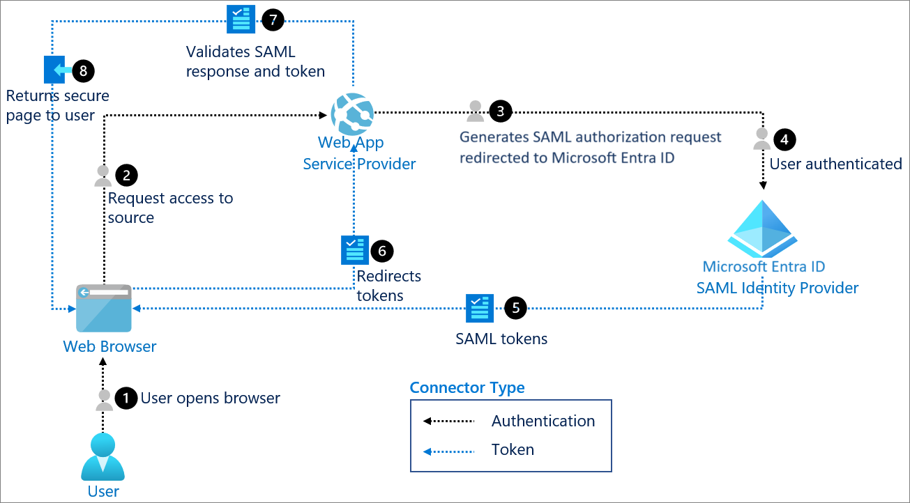
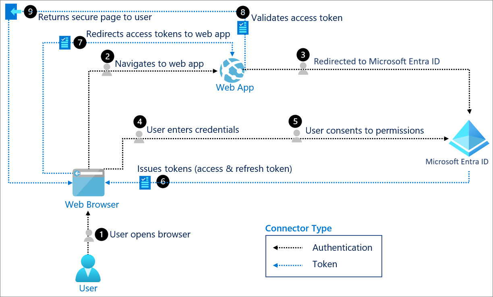

Building an authentication system from scratch is a pain and an architecting an incorrect one can often lead to security risks and eventually a system failure.
In this blog, I will show you the traits of building an authentication system and a correct one. Absolutely there are always use cases where you would need a specific architecture for your own needs but the authentication usually can and should be build using one of these methods.

The evolution of identity systems has come down to below systems.

#### SAML

The great ones use this. Usually for big enterprise companies where they need to handle identities of large number of employees and control in a centralized fashion. The definition looks like this:

> SAML stands for Security Assertion Markup Language (SAML) is a open standard used for exchanging authentication and authorization data between two parties: an Identity Provider (IdP) and Service Provider (SP).

By having a centralized control, where a user signin can be done using the core component SSO (Single Signon), user can now gain access to many different systems where the same IDP is used.

Three components make up the SAML system work:

- The Principal: Who? The user attempting to access a service
- The IDP - Who? The system that holds the user directory (phone book record system) who actually performs the authentication. Ex, Okta, Microsoft Entra ID/Azure AD, Auth0) and some others.
- The SP - Who? The resource/application the user wants to access (Microsoft Products, Google Products) are some of the examples.

Here is the flow:

 by mircrosoft

The Authentication Flow:

- The user tries to access a SP.
- The SP identifies the user's origin and redirects the user's request to the IdP.
- The user is presented with a screen from the IdP, where the user does the sign in process through often through MFA (Multi factor authentication).
- The IdP generates a SAML assertion, a XML document and sends back to the SP via the browser.
- The SP validates the assertion and grants the user access.
  So this is the basic flow of how SAML works.

SAML provides many features like Centralized control, SSO while reducing the password fatigue, Compliance features like audit trail for SOC2 or HIPAA.

#### OAuth

Now OAuth 2.0 is primarily used for Authorization like "What are you allowed to do or have access to?" and delegate access to other third party app giving access to perform some access on behalf of you. There are many OAuth providers like Google, Microsoft, Github etc which are used by many companies as their secondary methods of signin a user without having to enter a password. This works best with OIDC.

#### OIDC

 by mircrosoft

OIDC (Open ID Connect) is an additional layer on top of OAuth2.0 to add authentication. With OIDC the identity is handled by the OIDC and the access delegation is handled by the OAuth2.0. This is the modern standard for many companies and many providers like Okta provides these with MFA and other features out of the box.

Now let us understand about the why traditional old way of authentication like storing JWT in localstorage can make your system is an overkill.

- XSS attacks - Storing JWTs in localstorage can expose to real threats of XSS attacks where a malicious script can steal your tokens stored in localstorage.
- Stateless JWTs - If your JWTs are stateless, then you most likely using a microservice architecture and for some reason if want to revoke the access of a user, its hard to do. And if the token is stolen, then it can access the system and perform actions on behalf of you until the token expires.This are just cases to avoid using traditional JWTs handling in localstorage.

The modern architectures have become more secured with addition of new technologies which are making the single responsiblity a must have while designing a system.

#### BFF

BFF stands for (Backend for Frontends) is a component in the architecture which handles the heavy lifting of Authentication, Route aggregation, Proxy requests, data transformation etc. Think of a server which sits right or close next to frontend handling the heavy things for frontend. With BFF you can secure your tokens at the server side without exposing to your frontend. The tokens will never touch your browser. That is a massive security benefit which removes the XSS, CSRF attacks.

Now you can build your own from scratch or use battle tested libraries which will do the work for you. For Authentication support I will be used Duende software which provides OIDC, OAUth2.0, rotating tokens, revoke tokens, handling refresh tokens, port forwarding etc.

##### Duende BFF

 by Duende

> Duende.BFF is a library for building services that comply with the BFF pattern and solve security and identity problems in browser-based applications such as SPAs and Blazor-based applications. It is used to create a backend host that is paired with a frontend application. This backend is called the Backend For Frontend (BFF) host, and is responsible for all the OAuth and OIDC protocol interactions. It completely implements the latest recommendations from the IETF regarding security for browser-based applications.

Let's see the basic implementation of using Duende.BFF with .NET backend to handle SPA authentication.

Create a .NET Core web api (controllers/minimal) Bff project. Add the below packages:

```
dotnet add package Duende.Bff
dotnet add package Duende.Bff.Yarp
```

You can add your IdP credentials here in the appsettings.json

```json
 "[YourIdP]": {
    "Domain": "",
    "ClientId": "",
    "ClientSecret": "",
    "PostLoginRedirectUri": ""
  }
```

Here is the Program.cs

```csharp
using Duende.Bff;
using Duende.Bff.AccessTokenManagement;
using Duende.Bff.Yarp;
using WebBff.Configurations;
using WebBff.Extensions;

var builder = WebApplication.CreateBuilder(args);

// Add services to the container.
builder.Services.AddEndpointsApiExplorer();
builder.Services.AddSwaggerGen();

builder.Services.AddOptions<AuthSettings>().BindConfiguration(AuthSettings.SectionName);

builder.Services.AddDuendeBff(builder.Configuration);
builder.Services.AddAuthorization();


var app = builder.Build();
// Configure the HTTP request pipeline.
if (app.Environment.IsDevelopment())
{
    app.UseSwagger();
    app.UseSwaggerUI();
}
app.UseHttpsRedirection();
app.UseDefaultFiles(); // To serve index.html
app.UseStaticFiles();  // To serve React assets
app.UseRouting();
app.UseAuthentication();

// adds Duende BFF to the DI
// adds antiforgery protection for local APIs and other security rules.
app.UseBff();

// adds authorization for local and remote API endpoints
app.UseAuthorization();
// adds utilities for default login, logout etc endpoints by the Duende BFF
app.MapBffManagementEndpoints();
// You can add your custom endpoints here
app.MapEndpointsExtension();

// Proxy all remote API calls from the frontend through the BFF.
// Frontend should call /remote-api/<path> and the BFF forwards to https://localhost:7261/<path>.
app.MapRemoteBffApiEndpoint("/remote-api/users", new Uri(" https://localhost:7261/users"))
    .WithAccessToken(RequiredTokenType.User);

app.Run();
```

Let explore inside this extension method `builder.Services.AddDuendeBff(builder.Configuration);`.

```csharp
using Duende.Bff;
using Duende.Bff.Yarp;
using Microsoft.AspNetCore.Authentication;
using Microsoft.AspNetCore.Authentication.OpenIdConnect;
using Microsoft.IdentityModel.Protocols.OpenIdConnect;
using WebBff.Configurations;

namespace WebBff.Extensions;

public static class DuendeBffExtension
{
	public static IServiceCollection AddDuendeBff(this IServiceCollection services, IConfiguration configuration)
	{
		var auth0 = configuration.GetSection(AuthSettings.SectionName).Get<AuthSettings>();

    // adds authentication options to route the flow of authenticating a user
		services.AddAuthentication(options =>
		{
      // Cookie as a defaultScheme is the default fallback scheme which is used for authentication check
			options.DefaultScheme = "cookie";
      // OIDC as a ChallengeScheme is the flow to perform the authentication process.
			options.DefaultChallengeScheme = "oidc";
      // Signout Scheme
			options.DefaultSignOutScheme = "oidc";

		})
    // If DefaultScheme is used, it run this operation.
		.AddCookie("cookie", options =>
		{
			// set session lifetime
			options.ExpireTimeSpan = TimeSpan.FromHours(0.1);

			// sliding or absolute
			options.SlidingExpiration = false;

			// host prefixed cookie name
			options.Cookie.Name = "__MySignalHub-spa";

			// Because we use an identity server that's configured on a different site
			// (duendesoftware.com vs localhost), we need to configure the SameSite property to Lax.
			// Setting it to Strict would cause the authentication cookie not to be sent after logging in.
			// The user would have to refresh the page to get the cookie.
			// Recommendation: Set it to 'strict' if your IDP is on the same site as your BFF.
			options.Cookie.SameSite = SameSiteMode.Lax;
		})
    // If ChallengeScheme is used, it run this operation.
		.AddOpenIdConnect("oidc", options =>
		{
      // You can configure your Identity Provider (IdP) credentials here.
			options.Authority = auth0?.Domain;
			options.ClientId = auth0?.ClientId;
			options.ClientSecret = auth0?.ClientSecret;

			options.CallbackPath = "/bff/callback";
			options.ResponseType = OpenIdConnectResponseType.Code;
			options.ResponseMode = OpenIdConnectResponseMode.Query;
      // keeps the size of cookie small
			options.GetClaimsFromUserInfoEndpoint = true;

			// REQUIRED: This tells .NET to save tokens in the cookie
			options.SaveTokens = true;

			options.MapInboundClaims = false;
      // Built in scopes can be used for access and restricting a user.
			options.Scope.Clear();
			options.Scope.Add("openid");
			options.Scope.Add("profile");
			options.Scope.Add("email");
			options.Scope.Add("API");
			// Add this scope if you want to receive refresh tokens
			options.Scope.Add("offline_access");

      // Life cycle events can be used to perform custom operations like post signin/signout.
			options.Events = new OpenIdConnectEvents
			{
      // Post signin event
				OnTicketReceived = context =>
				{
          // Log tokens for debugging
					var accessToken = context.Properties?.GetTokenValue("access_token");
					var refreshToken = context.Properties?.GetTokenValue("refresh_token");
					var idToken = context.Properties?.GetTokenValue("id_token");
					Console.WriteLine("==============");
					Console.WriteLine($"Access Token: {accessToken}");
					Console.WriteLine($"Refresh Token: {refreshToken}");
					Console.WriteLine($"ID Token: {idToken}");
					Console.WriteLine("==============");
					context.ReturnUri = auth0?.PostLoginRedirectUri;
					return Task.CompletedTask;
				},
        // Post signout event
				OnSignedOutCallbackRedirect = context =>
				{
          // for clearing the session for the user etc.
					context.Response.Redirect("http://localhost:5173/");
					context.HandleResponse();
					return Task.CompletedTask;
				}
			};
		});
    // Adds Duende BFF to the DI
		services.AddBff()
    // Used by YARP as HTTP for port forwarding
		.AddRemoteApis()
    // Adds In memory session store
		.AddServerSideSessions();

		return services;
	}
}
```

The Yarp with Duende gives you many utilities with added security rules out of the box without you have to confugure it. The basic remote api endpoints feature is to use http port forwarding where its best to use cluster or group the endpoints with a tag, so that you can dont have to write the mapping of every endpoints in your remote services. If you want to configure Yarp without using the port forwarding you can do that as well.
Now the frontend is simple and you can build in any framework. The login endpoint should be redirect to `/bff/login` and the logout endpoint include the logout_url you get from the claims or you can call the `/bff/logout` and include the session id from the user claims.
Finally build the frontend project and include the build files in the `wwwroot` folder under the .NET project.
You can create an image and host it in the Azure Container Apps, make sure to update the callback url and domain url. You can use the Azure key vault and configure it your app.

Let me know if you need the Deployment Part of this project and I will write another blog for this.

Now lets understand what are the Top 10 OWASP. But what is OWASP ?

> The Open Worldwide Application Security Project (OWASP) is an open community dedicated to enabling organizations to develop, purchase, and maintain applications and APIs that can be trusted.

1. Broken Access Control - This is the #1 security break in the OWASP 2025 list. A user can read other user's data and modify it. Ex. Changing a URL `/user/1` to `/user/2` to read other user data. This can be blocked by using a BFF as a gatekeeper wherein you can first authroize the `/user` endpoint and second for this query you can check `if (UserPayload.Id == AuthenticatedUser.GetId())` and restrict the users for seeing other profiles.

2. Cryptographic Failures - Sensitive or private data such as passwords or PII, which is sent in plain text or weak encryption or not using HTTPS. The attacker can easily see this data and can get into your network. This can be fixed using BFF adding HSTS (HTTP Strict Transport Security) so browser talks ihn HTTPS only. For the encryption use BCrypt or other strong encryption methods for hashing sensitive data.

3. Injection - The application form interprets input text into code which results into SQL injection attacks. The attacker can now bypass the login or steal your entire database. The fix is to first sanitize your inputs before going to your internal services. And use ORM or paratermize SQL queries and use Content Security Policy (CSP) which mitigates XSS attacks can control what pages or urls browser should allow to load.

4. Insecure Design - A feature which gives away too many security flaws and expose private info like a "Forgot Passowrd" feature which wants you to answer some simple questions or gives you simple puzzles to solve them and then you can access the protected page. The fix is rather than reinventing the complex logic your own, use a trusted third party Identity frameworks or use a MFA and offload these security features to the BFF so the frontend just follows the instructions given by the BFF. Dont add too much complex feature in your frontend, these are exposed to the browser and we should not trust browsers.

5. Security Misconfiguration - Leaving loopholes exposed to the internet like 'Debug mode' which is used for development only is been used in production and leaving private info as public with no protection. This can be fixed using BFF. Strip out headers like `X-Powered-By: [You programming stack is exposed here]`. Use flags to avoid running development configuration in production.

6. Vulnerable and Outdated Components - Using third party old/legacy/un-trusted packages which is not maintained by the owners or being staled for years and can have loopholes or security flaws which attacker knows how to break them. Use dependencies analyzers in your CI pipeline before pushing to releasing to production, which checks for vulnerabities and risks and blocks the build and alerts the system.

7. Identification of Authentication Failures - Bad Authentication practices. Storing JWT in your localstorage and a weak session management. BFF never ever stores your tokens in the browser, it stores them in memory and gives the browser a Secure, HttpOnly and Samesite=Strict cookie which Javascript cannot read.

8. Software and Data Integrity Failures - Trusting third party plugins or code without verifying the source. The attacker can inject malicious code in this systems. Always check your dependencies, external APIs, plugins and use them from verified sources.

9. Security Logging and Monitoring Failures - A security flaw or something mishap hapened within your system and the owner is not zero knowledge. Your system might have been hacked and you never knew. Add centralized logging system with metrics having threshold to notify you if certain limit has been reached or something went wrong with your system. BFF can perform great here as it has knowledge of every traffic passing through it.

10. Server side Request Forgery (SSRF) - Here an attacker can trick your server into making a request to an internal resource what are not exposed to public. Ex. Calling other service from your own service. This way attackers can access your database or cloud metadata. Whitelist the URLs in the BFF. Sanitize client endpoints before getting details from it and only allow specific domains from your list.

I have only covered the scratch here and there a lot of things to cover for authentication and it is a whole new architecture and has books written just for it. I have only written what I am practising and there a lot to learn as well. Authorization is another thing which is required. You can add scopes and policy to restrict and allow limited access to users.
Let me know what you think about authentication and any suggestions you have please reach out at my socials.

References:

1. SAML Auth Flow - https://learn.microsoft.com/id-id/entra/architecture/auth-saml
2. OIDC Auth Flow - https://learn.microsoft.com/id-id/entra/architecture/auth-oidc
3. Duende Bff - <https://docs.duendesoftware.com/bff/>
4. OWASP Top 10 - <https://owasp.org/>
